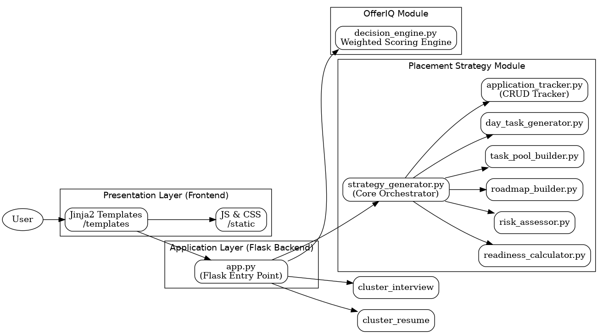

# CareerOS – System Architecture

---

## Architecture Diagram



---

## 1. High-Level Architecture

CareerOS follows a **modular layered architecture** consisting of:

- **Presentation Layer** – Jinja2 Templates with Static JS & CSS
- **Application Layer** – Flask Backend (`app.py`)
- **Core Engine Layer** – Independent Career Modules

The system is structured as a modular monolith where each module operates independently but is orchestrated through the Flask backend.

---

## 2. Core Modules

### 1️⃣ OfferIQ Module
Responsible for analyzing and ranking job offers using a Weighted Sum Model.

**Engine File:**
- `decision_engine.py`

---

### 2️⃣ Placement Strategy Module
Generates personalized career preparation strategies.

**Core Orchestrator:**
- `strategy_generator.py`

**Submodules:**
- `readiness_calculator.py`
- `risk_assessor.py`
- `roadmap_builder.py`
- `task_pool_builder.py`
- `day_task_generator.py`
- `application_tracker.py`

---

### 3️⃣ Interview Prep Module
Provides structured interview preparation workflows.

---

### 4️⃣ Resume Builder Module
Helps users structure and generate optimized resumes.

---

## 3. Data Flow — OfferIQ

1. User submits offer details via frontend.
2. Request reaches `app.py` (Flask backend).
3. Backend calls `decision_engine.py`.
4. Offers are normalized and scored using Weighted Sum Model.
5. Ranked output is returned to frontend.
6. Results are displayed.

---

## 4. Data Flow — Placement Strategy

1. User enters career goals and timeline.
2. `app.py` calls `strategy_generator.py`.
3. Orchestrator invokes:
   - Readiness calculation
   - Risk assessment
   - Roadmap construction
   - Task generation
   - Daily planning
   - Application tracking
4. Final structured strategy is returned and displayed.

---

## 5. Backend Project Structure

```
careerOS/
├── app.py
├── decision_engine.py
├── placement/
│   ├── strategy_generator.py
│   ├── readiness_calculator.py
│   ├── risk_assessor.py
│   ├── roadmap_builder.py
│   ├── task_pool_builder.py
│   ├── day_task_generator.py
│   └── application_tracker.py
├── templates/
└── static/
```

---

## 6. OfferIQ Scoring Algorithm (Weighted Sum Model)

### Steps

1. Collect offer parameters.
2. Normalize values (Min-Max normalization).
3. Apply benefit/cost inversion where necessary.
4. Multiply by weights.
5. Compute total score.
6. Rank offers.

---

### System Weights

| Factor               | Weight | Type     |
|----------------------|--------|----------|
| Salary               | 0.30   | Benefit  |
| Work-Life Balance    | 0.20   | Benefit  |
| Location Preference  | 0.15   | Benefit  |
| Company Rating       | 0.15   | Benefit  |
| Growth Opportunities | 0.10   | Benefit  |
| Layoff Risk          | 0.10   | Cost     |
| **Total**            | **1.00** | — |

---

## 7. Architectural Characteristics

- Modular Design
- Low Coupling
- Clear Separation of Concerns
- Extensible Engine Architecture
- Scalable for Future Database Integration

---

